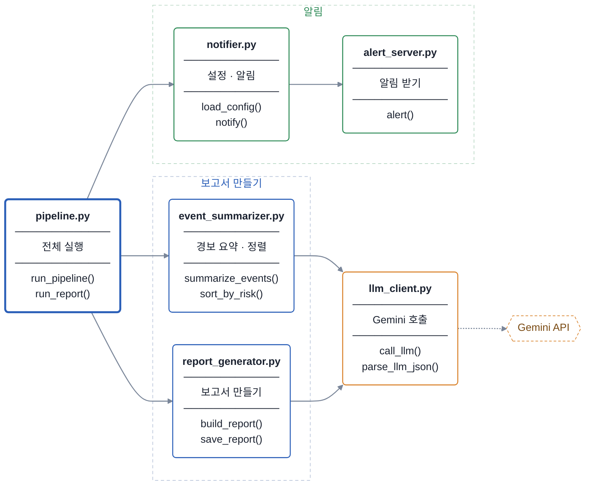

# security-agent-toolkit

SKT ALEPH 국비교육(9/28~10/8) 실습 저장소입니다.
밤사이 쌓인 보안 경보를 LLM(Gemini)으로 요약하고, 보고서(`.md`)를 만든 뒤 알림 서버로 알려 주는 파이프라인을 만들었습니다.

## 흐름



`python pipeline.py` 한 번이면 설정 읽기 → 경보 요약 → 보고서 저장 → 알림까지 차례로 돕니다.
LLM 호출이나 알림이 실패해도 멈추지 않고, 보고서는 남습니다.

## 파일

| 파일 | 역할 | 함수 |
|---|---|---|
| `pipeline.py` | 전체를 순서대로 실행 | `run_pipeline` · `run_report` |
| `event_summarizer.py` | 경보를 6건씩 요약하고 위험한 순서로 정렬 | `summarize_batch` · `summarize_events` · `sort_by_risk` |
| `report_generator.py` | 총평을 받고 보고서를 만들어 저장 | `make_lines` · `make_overview` · `build_report` · `save_report` |
| `llm_client.py` | Gemini 호출, 답을 JSON 으로 읽기 | `find_env` · `read_api_key` · `call_llm` · `parse_llm_json` |
| `notifier.py` | 설정 검사, 승인 판정, 알림 보내기 | `load_config` · `needs_approval` · `notify` |
| `alert_server.py` | 알림을 받아 터미널에 출력 (Flask) | `alert` |
| `test_agent_core.py` | 위 함수들의 단위 테스트 9건 | — |

그 전에 만든 실습 파일: `api_client.py`(외부 API 재시도), `scheduler_job.py`(정기 점검), `webhook_server.py`(웹훅 수신), `tool_router.py`(LLM 도구 선택).

## 폴더 구조

```
security-agent-toolkit/
├─ .vscode/settings.json   노트북 실행 위치를 agent_core 로 고정
├─ docs/                   일지 · 회고
└─ agent_core/
   ├─ *.py                 파이프라인 모듈 · 서버 (서로 import 하므로 한 폴더에 둔다)
   ├─ *.json · raw_logs.txt 실습 데이터 · 설정 · 실행 결과
   ├─ notebooks/           수업 노트북 (yymmdd_am|pm_주제.ipynb)
   ├─ practice/            10/2 연습 서버 · argparse 연습 · curl 스크립트
   └─ reports/             지난 보고서
```

노트북은 `notebooks/` 안에 있지만 `.vscode/settings.json` 의 `jupyter.notebookFileRoot` 덕분에 **`agent_core` 폴더에서 실행**됩니다. 그래서 노트북 안의 상대 경로(`config.json`, `../docs/…`)와 `%%writefile` 이 예전과 똑같이 동작합니다. VS Code 에서 `security-agent-toolkit` 폴더를 열어야 이 설정이 적용됩니다.

새로 만드는 보고서는 `report_generator.py` 가 `agent_core` 에 바로 저장합니다. 지난 보고서는 `reports/` 로 옮겨 둡니다.

## 실행

```bash
cd agent_core
python -m venv .venv
source .venv/bin/activate          # Windows: .venv\Scripts\activate
pip install requests flask schedule
```

`agent_core/.env` 에 Gemini API 키를 넣습니다. 이 파일은 `.gitignore` 로 막혀 있어 올라가지 않습니다.

```
GEMINI_API_KEY=발급받은_키
```

터미널 두 개에서 실행합니다.

```bash
python alert_server.py     # 터미널 1 — 알림 서버 (5001 번 포트)
python pipeline.py         # 터미널 2 — 보고서 생성 + 알림
python test_agent_core.py  # 테스트 — [테스트 통과] 9건 모두
```

## 설정 — config.json

| 키 | 기본값 | 뜻 |
|---|---|---|
| `model` | `gemini-3.5-flash-lite` | 부를 LLM |
| `approve_severity` | `high` | 이 위험도 이상이면 사람이 확인 |
| `report_folder` | `reports` | 보고서를 모을 폴더 |
| `webhook_url` | `http://127.0.0.1:5001/alert` | 알림을 보낼 주소 |

비밀(API 키)은 `.env`, 비밀이 아닌 설정은 `config.json` 에 둡니다.

## 회고

전체 내용은 [docs/day08_retrospective.md](docs/day08_retrospective.md) 에 있습니다.

| 항목 | 요약 |
|---|---|
| 만든 것 | 로그에서 보안 경보 추출 → LLM 으로 위험도 평가 · 요약 → 보고서 생성 → 알림 서버로 팀장에게 보고하는 파이프라인 |
| 가장 어려웠던 것 | 같은 포트에 Flask 서버가 여러 번 떠서 생긴 충돌. 실행 전에 포트 사용 여부를 확인하고, 필요하면 서버를 끄거나 다른 포트를 쓰도록 했다 |
| 리뷰에서 고친 것 | LLM 응답 JSON 파싱이 실패하면 `None` 을 돌려주고 뒤에서 처리하도록 수정. 위험도 비교에서 대소문자 · 공백을 무시하도록 수정 (`.strip().lower()`) |
| 캡스톤에서 해 볼 것 | LLM 응답을 더 정교하게 처리, 경보 유형별 대응 자동화, 보고서에 시각화 추가 |
